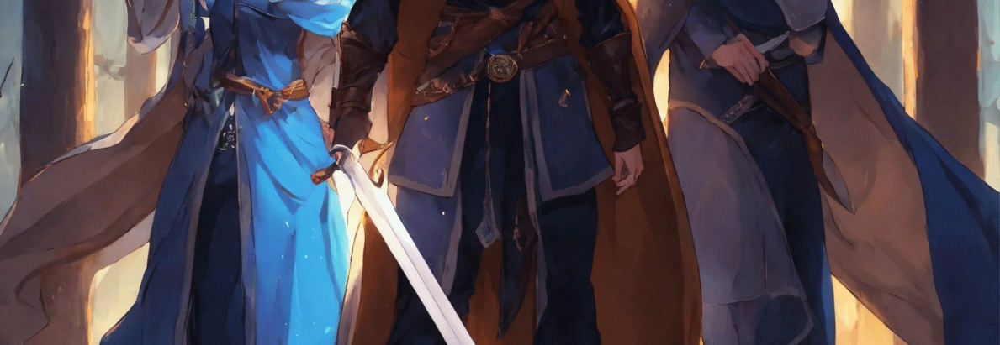

# Dark Fate

Dark Fate is a modern-day, GM-facing variant of the same ruleset as [Fate of Ars Magica.md](./Fate%20of%20Ars%20Magica.md): liches, vampires, and mortals wielding raw elemental power instead of mythic Europe's Hermetic mages. It reuses Fate of Ars Magica's core rules — character creation basics, sub-skills, stress and consequences, weapons and armor, experience, and Scale — with the differences below.

## Character Creation Differences

**Step 1: Aspects** — replace *House* with **Trouble**, and add a **Bond** aspect instead of *Bodyguard*.

**Step 2: Details** — Name, Age, Gender, Profession, Colors, Nationality, Totem, Background.

**Step 3: Skill Tree** — instead of ranking every skill, the character picks **10 skills** to be trained in; every other skill sits at **Poor**, not Mediocre.

- Choose **3 physical skills**, **2 social skills**, and **3 skills of any category** among the 10.
- The 10 trained skills still follow **One Great, Two Good, Three Fair, Four Average** (same distribution as the core rules).
- **Sub-skills** work exactly as described in [Fate of Ars Magica.md](./Fate%20of%20Ars%20Magica.md)'s Skill List (one sub-skill per point of the skill's rating, Mediocre fallback outside chosen sub-skills) — **except Will**, which has no sub-skills.

### Dark Fate Skill List

| Category     | Skill        | Sub-skill examples                                                |
| ------------ | ------------ | ------------------------------------------------------------------ |
| **Physical** | Alertness    | Perception, Listening, Tracking, Initiative                        |
| **Physical** | Burglary     | Lock picking, Cutpurse, Disarm traps                                |
| **Physical** | Fight        | Light, Martial, Heavy weapons, Ranged                               |
| **Physical** | Physique     | Brawling, Weight lifting, Athletics, Thrown                         |
| **Physical** | Stealth      | Sneak, Hide                                                         |
| **Physical** | Travel       | Ride, Sailing, Orienteering, Survival                               |
| **Social**   | Contacts     | —                                                                    |
| **Social**   | Influence    | Persuasion, Deception, Leadership, Negotiation, Intimidation        |
| **Social**   | Languages    | 1 per skill level                                                   |
| **Social**   | Will         | no sub-skills                                                       |
| **Academic** | Occult       | Symbols, Dark languages, Creatures, Esoterica                       |
| **Academic** | Medicine     | First aid, surgery, herbal medicine, infectious                    |
| **Academic** | Investigate  | Deduction, Scrutiny, Research, Observation, Interrogation           |
| **Academic** | Lore         | —                                                                    |
| **Academic** | Crafts       | Blacksmith, woodsmith, ceramics, mechanics                          |
| **Academic** | Primal       | Animal handling, tracking, Animal communication, flight, swimming  |

Refresh, milestones, and Circumstantial Penalties are unchanged from [Fate of Ars Magica.md](./Fate%20of%20Ars%20Magica.md).

## Stress and Consequences Differences

In addition to Physique (physical stress) and Will (mental stress), **Occult/Primal** determines **mystical stress**, called **MANA**. The Stress Points table and the rest of the Stress and Consequences rules are unchanged from [Fate of Ars Magica.md](./Fate%20of%20Ars%20Magica.md).

## Weapons & Armor

Unchanged from [Fate of Ars Magica.md](./Fate%20of%20Ars%20Magica.md). Parma Magica does not exist in this variant, so the Parma-specific notes there don't apply.

## Experience

Unchanged from [Fate of Ars Magica.md](./Fate%20of%20Ars%20Magica.md).

## Scale

Unchanged from [Fate of Ars Magica.md](./Fate%20of%20Ars%20Magica.md).

---

## Powers

### Geometry

| **Area**     | Description                                                 |
| ------------ | ----------------------------------------------------------- |
| **▽ Cone**   | Area * m length in a cone shape. Base radius = area * 0.5 m |
| 𐰧 Sphere     | Area * meters diameter. Hits everything inside              |
| Π Wall       | Area * m³ wall, height equals the mage's height             |
| **◎ Ring**   | Area * meters diameter. Only the ring's edges               |
| **⊚ Person** | Single target                                               |

### Range, Area, and Duration

| Magnitude | Range              | Area | Duration     |
| --------- | ------------------ | ---- | ------------ |
| **+0**    | Melee              | 1    | Moment/Scene |
| **+1**    | Speech             | 3    | Scene        |
| **+2**    | Sight              | 6    | Hour         |
| **+3**    | Magical connection | 10   | Day          |
| **+4**    | Across dimensions  | 15   | Evening      |

Magnitude limit: the character's Power skill determines the maximum magnitude. "Great" allows magnitude +4.

### Area with Geometry

| Area | Wall   | Sphere/Ring | Cone length | Base radius |
| ---- | ------ | ----------- | ----------- | ----------- |
| 1    | 1×2 m  | 1 m radius  | 1 m         | 0.5 m       |
| 3    | 3×2 m  | 3 m radius  | 3 m         | 1.5 m       |
| 6    | 6×2 m  | 6 m radius  | 6 m         | 3 m         |
| 10   | 10×2 m | 10 m radius | 10 m        | 5 m         |
| 15   | 15×2 m | 15 m radius | 15 m        | 7.5 m       |

### Magic and Elemental Control

An Element Controller chooses one element, which can be anything the player wants — even hair control, numbers, whatever can be explained. Element control is intuitive or raw magic.

A Mage learns new elements and spells based on them.

- Learning a new element requires a book, a teacher, or coercing an elemental into revealing its true name.
- Costs 1 Fate point.
- At character creation: 1 element per Occult level or Mystical trait level, plus 1 per Magic level.

#### Techniques

A Technique costs one stunt. It is tied to a specific power.

|       | Magic          | Element Control | Description                                   |
| ----- | -------------- | --------------- | --------------------------------------------- |
| Θ     | Study          | Study           | Study the element                             |
| Φ     | Portal         | Create          | Create the element, heal with the element     |
| Λ     | Bend           | Guide           | Telekinesis with the element                  |
| Δ     | Transformation | Change          | Transform the target                          |
| ψ     | Animate        | —               | Animate the inanimate and give it an aspect   |
| **⇄** | Swap           | —               | Swap two targets' properties                  |
| Ω     | —              | Remove          | Remove the element or remove with the element |

#### Magic Elements (Forms)

| Name              | Property                                             |
| ----------------- | ---------------------------------------------------- |
| **Ξ Earth**       | Durable, permanent, lethal                           |
| **𐰒 Fire**        | Gives target the aspect "burning"                    |
| **≋ Water**       | Knocks down, stops, wets, superficial damage         |
| **𐱄 Air**         | Pure air or kinetic energy, moves does not damage    |
| **𐰛 Plants**      | Control plants, requires Herbalism for poisons       |
| **𐰌 Body**        | Control and summon humanoid bodies                   |
| **𐰢 Animals**     | Control and summon animal bodies and minds           |
| **✧ Light**       | Frightens undead, illuminates, harms vampires        |
| **⚡︎ Electricity** | +1 advantage against targets carrying metal          |
| **♩ Sound**       | Prevents speaking, spellcasting, protects from noise |
| **🜛 Magnetism**   | Stops and controls metals, useless vs. flesh         |

### Magic

A mage learns elements one by one. Initially they gain elements based on skills; later they must seek rare tomes, elementals, or powerful beings.

Learning a new element costs 1 Fate point. The element can be anything — the stranger it is, the harder it is to describe.

#### Standardized Magic

The mage learns standardized spells and can cast them without a focus or willpower points. Casting requires audible speech and hand gestures, which glow with magical sigils.

They can improvise a spontaneous spell, but it costs mental stress.

Standard spells have 5 levels:

- Level 0: no mana cost
- Level 1: 1 mana
- Level 2: 2 mana
- Levels 3–5: add variables; mage chooses mana spent

Variables:

- Level 3: add range, area, or duration
- Level 4: add a second variable
- Level 5: add a third variable

#### Spontaneous Magic (Dark Fate)

A spontaneous spell is invented on the fly. It costs 1 mental stress per spell.

If the same spell is cast repeatedly in a session, it can be purchased as a standard spell with a mild mental consequence (max 1 per session).

The mage invents the effect, geometry, and pays mana for area, range, and duration.

#### Instrumental Magic

The mage channels magic through a focus. Without a focus, every spell costs mental stress.

Instrumental mages cast everything spontaneously; they do not need standard spells after apprenticeship.

#### Warping (Magical Distortion)

When a mage needs mana but has none, they draw from outer reserves or patrons, causing distortion.

Distortion is a magical consequence. It heals only by not using magic.

- Mild distortion: +2 mana
- Moderate: +4 mana
- Severe: +6 mana
- Permanent: +8 mana

### Φ Magus – Create: Portal Spells

By invoking the true name of an element, the Magus opens a portal to the Umbra (the spirit world) and draws in raw spirit‑matter, shaping it into the desired element and form.

#### Fire (Φ𐰒)

| Element | P    | Name            | Range  | Area       | Duration |
| ------- | ---- | --------------- | ------ | ---------- | -------- |
| **Φ𐰒𐰧** | 0    | Fire Hands      | Melee  | 1 m radius | Moment   |
|         | 1    | Fire Bolt       | Speech | 1 m radius | Moment   |
|         | 2    | Fireball        | Speech | 3 m radius | Moment   |
| **Φ𐰒Π** | 0    | Fire Pillar     | Melee  | 1×2 m      | Scene    |
|         | 1    | Fire Wall       | Melee  | 3×2 m      | Scene    |
|         | 2    | Fire Rampart    | Melee  | 3×2 m      | Scene    |
| **Φ𐰒◎** | 0    | Fire Shield     | Self   | 1 m radius | Scene    |
|         | 1    | Fire Aura       | Self   | 1 m radius | Scene    |
|         | 2    | Ring of Fire    | Self   | 3 m radius | Scene    |
| **Φ𐰒▽** | 0    | Fire Hands      | Melee  | 1 m        | Moment   |
|         | 1    | Flamethrower    | Melee  | 3 m        | Moment   |
|         | 2    | Dragon's Breath | Melee  | 6 m        | Moment   |

#### Earth (ΦΞ)

| Element | P    | Name         | Range  | Area       | Duration |
| ------- | ---- | ------------ | ------ | ---------- | -------- |
| **ΦΞ𐰧** | 0    | Shards       | Melee  | 1 m radius | Moment   |
|         | 1    | Stone Spikes | Melee  | 3 m radius | Moment   |
|         | 2    | Stone Rain   | Speech | 3 m radius | Moment   |
| **ΦΞΠ** | 0    | Stone Pillar | Melee  | 1×2 m      | Moment   |
|         | 1    | Stone Wall   | Melee  | 3×2 m      | Moment   |
|         | 2    | Wall         | Speech | 3×2 m      | Moment   |
| **ΦΞ◎** | 0    | Stone Shield | Self   | 1 m radius | Moment   |
|         | 1    | Small Tower  | Self   | 1 m radius | Scene    |
|         | 2    | Prison Tower | Speech | 3 m radius | Moment   |
| **ΦΞ▽** | 0    | Sand Strike  | Melee  | 1 m        | Moment   |
|         | 1    | Sand Breath  | Melee  | 3 m        | Moment   |
|         | 2    | Sandblast    | Melee  | 3 m        | Scene    |

#### Water (Φ≋)

| Element | P    | Name          | Range  | Area       | Duration |
| ------- | ---- | ------------- | ------ | ---------- | -------- |
| **Φ≋𐰧** | 0    | Water Strike  | Melee  | 1 m radius | Moment   |
|         | 1    | Water Orb     | Speech | 1 m radius | Moment   |
|         | 2    | Water Storm   | Speech | 3 m radius | Scene    |
| **Φ≋Π** | 0    | Water Column  | Melee  | 1×2 m      | Moment   |
|         | 1    | Water Wall    | Melee  | 3×2 m      | Scene    |
|         | 2    | Water Rampart | Speech | 3×2 m      | Scene    |
| **Φ≋◎** | 0    | Water Shield  | Self   | 1 m radius | Moment   |
|         | 1    | Water Aura    | Self   | 1 m radius | Scene    |
|         | 2    | Water Ring    | Self   | 3 m radius | Scene    |
| **Φ≋▽** | 0    | Splash        | Melee  | 1 m        | Moment   |
|         | 1    | Water Breath  | Melee  | 3 m        | Moment   |
|         | 2    | Water Blast   | Melee  | 6 m        | Moment   |

#### Air (Φ𐱄)

| Element     | P    | Name                | Range  | Area       | Duration |
| ----------- | ---- | ------------------- | ------ | ---------- | -------- |
| **Φ𐱄𐰧** | 0    | Wind Strike         | Melee  | 1 m radius | Moment   |
|             | 1    | Wind                | Speech | 1 m radius | Moment   |
|             | 2    | Vortex              | Speech | 3 m radius | Scene |
| **ΦΠ𐱄** | 0    | Air Column          | Melee  | 1×2 m      | Moment   |
|             | 1    | Air Shield          | Melee  | 3×2 m      | Moment   |
|             | 2    | Air Rampart         | Speech | 3×2 m      | Scene    |
| **Φ◎𐱄 ** | 0    | Air Shield          | Self   | 1 m radius | Moment   |
|             | 1    | Air Aura            | Self   | 1 m radius | Scene    |
|             | 2    | Wind Wall           | Self   | 3 m radius | Scene    |
| **Φ𐱄▽** | 0    | Gust                | Melee  | 1 m        | Moment   |
|             | 1    | Wind Blast          | Melee  | 3 m        | Moment   |
|             | 2    | Breath of the Storm | Melee  | 6 m        | Moment   |
| **Φ𐱄𐰧** | 0    | Jump             | Self   | Self       | Moment   |
|         | 1    | Flight           | Self   | Self       | Scene    |
|         | 2    | Throw Bomb       | Speech | 3 m radius | Moment   |
| **Φ𐱄𐰧** | 0    | TK Push          | Melee  | 1 m radius | Moment   |
|         | 1    | TK Distant Push  | Speech | 1 m radius | Moment   |
|         | 2    | Area Push        | Speech | 3 m radius | Moment   |
| **Φ𐱄◎** | 0    | Push Shield      | Self   | 1 m radius | Scene |
|         | 1    | Sustained Shield | Self   | 1 m radius | Scene    |
|         | 2    | Knockdown Wave   | Self   | 3 m radius | Scene    |

### Λ Wizard – Bend Energy

| Element          | Description                                                  |      |
| ---------------- | ------------------------------------------------------------ | ---- |
| 𐰒 Fire           | Direct heat in different directions.                         |      |
| ⚡︎ Electricity    | Direct electrical energy in different directions.            |      |
| ♩ Sound          | Bend sound, redirect it, silence it.                         |      |
| ✧ Light          | Bend light; create invisibility at the cost of being unable to see yourself. |      |
| 🜛 Magnetism      | Direct magnetic energy.                                      |      |
| 𐱄 Kinetic Energy | Bend attacks, redirect falling into gliding, general-purpose force shield. |      |

Bend Energy manipulates **pure energies**. It allows control over **kinetic energy**, which does *not* allow true flight, but does allow **gliding**. It allows invisibility by bending light around you — but because the light does not reach your eyes, you cannot see. This can be bypassed by first casting a magical sight spell (e.g., infrared vision) and then invisibility.

A kinetic shield blocks **heat** because it prevents thermal motion from crossing the barrier. It blocks **sound** because sound is movement. It does **not** block light or electricity.

You cannot bend stone, plants, or bodies — only **energies**.

Gravity cannot be bent, but combining **Create: Kinetic Energy** with **Bend Energy** (+1 magnitude) enables true flight.

Manipulating sound and kinetic energy overlap, but sound master wizard has specialized on sound, so he can make more efficient spells.

#### Λ Wizard Spell List

| Element | P    | Name                                 | Range  | Area       | Duration |
| ------- | ---- | ------------------------------------ | ------ | ---------- | -------- |
| **Λ𐰒𐰧** | 0    | Repel Heat (melee)                   | Melee  | 1 m radius | Moment   |
|         | 1    | Repel Heat (ranged)                  | Speech | 1 m radius | Moment   |
|         | 2    | Repel Heat (area)                    | Speech | 3 m radius | Moment   |
| **Λ𐰒Π** | 0    | Heat Shield (blocks heat…)           | Melee  | 1×2 m      | Scene    |
|         | 1    | Heat Shield (both directions)        | Melee  | 3×2 m      | Scene    |
|         | 2    | Heat Shield (all directions)         | Melee  | 3×2 m      | Scene    |
| **Λ𐰒◎** | 0    | Heat Aura                            | Self   | 1 m radius | Scene    |
|         | 1    | Protection from Fire or Cold         | Self   | 1 m radius | Scene    |
|         | 2    | Enhanced Protection                  | Self   | 3 m radius | Scene    |
| **Λ⚡︎◎** | 0    | Grounding (protect from electricity) | Self   | 1 m radius | Moment   |
|         | 1    | Sustained Grounding                  | Self   | 1 m radius | Scene    |
|         | 2    | Area Grounding                       | Self   | 3 m radius | Scene    |
| **Λ♩𐰧** | 0    | Silence Nearby                       | Melee  | 1 m radius | Scene    |
|         | 1    | Silence Small Area                   | Speech | 1 m radius | Scene    |
|         | 2    | Silence Area                         | Speech | 3 m radius | Scene    |
| **Λ♩Π** | 0    | Sound Wall                           | Melee  | 1×2 m      | Scene    |
|         | 1    | Reflective Sound Wall                | Melee  | 3×2 m      | Scene    |
|         | 2    | Sustained Sound Wall                 | Speech | 3×2 m      | Scene    |
| **Λ♩◎** | 0    | Silence Bubble                       | Self   | 1 m radius | Scene    |
|         | 1    | You cannot be heard, but…            | Self   | 1 m radius | Scene    |
|         | 2    | You cannot hear either               | Self   | 3 m radius | Scene    |
| **Λ♩▽** | 0    | Silence Enemy                        | Melee  | 1 m        | Scene    |
|         | 1    | Silence Enemies                      | Melee  | 3 m        | Scene    |
|         | 2    | Keep Them Silent                     | Melee  | 3 m        | Scene    |
| **Λ✧Π** | 0    | Mirror Wall (reflect light)          | Melee  | 1×2 m      | Scene    |
|         | 1    | Large Mirror                         | Melee  | 3×2 m      | Scene    |
|         | 2    | Distant Mirror                       | Speech | 3×2 m      | Scene    |
| **Λ✧◎** | 0    | Invisibility                         | Self   | 1 m radius | Scene    |
|         | 1    | Improved Invisibility                | Self   | 1 m radius | Scene    |
|         | 2    | Group Invisibility                   | Self   | 3 m radius | Scene    |
| **Λ𐱄⊚** | 0    | Levitate                             | Self   | Self       | Scene    |
|         | 1    | Levitate II                          | Self   | Self       | Scene    |
| **Λ𐱄𐰧** | 2    | Group Levitation                     | Self   | 3 m radius | Scene    |
| **Λ𐱄Π** | 0    | Force Shield (stops movement)        | Melee  | 1×2 m      | Scene    |
|         | 1    | Durable Force Shield                 | Melee  | 1×2 m      | Scene    |
|         | 2    | Group Force Shield                   | Melee  | 3×2 m      | Scene    |

### Δ Druid – Transformation

Transformation spells inflict **transformation damage**. This works like normal physical damage, causing physical consequences, but it does **not** actually injure the target. Instead, the target's body is magically reshaped. So base durations are Transformation damage (TD) or concentration for personal changes.

A **Severe physical transformation consequence** fully transforms the target into the form described by the spell. For example: turning someone into a pig requires inflicting a Severe transformation consequence. This heals the same way as a Severe physical (lethal) injury.

To learn a new form, the druid must obtain a piece of the creature — a hair, claw, or blood — and perform a ritual to learn how to assume that form.

At character creation, the number of animal forms known is based on the **Survival** skill:

| Survival Skill | Starting Animal Forms |
| -------------- | ---------------------- |
| **Average**    | 1                       |
| **Fair**       | 3                       |
| **Good**       | 6                       |
| **Great**      | 10                      |

#### Δ Druid – Transformation Spells

| Element | P    | Name                    | Range      | Area      | Duration  |
| ------- | ---- | ----------------------- | ---------- | --------- | --------- |
| **Δ𐰢**𐰧 | 0    | You are a pig           | Melee      | Single    | TD        |
|         | 1    | You there are a pig     | **Speech** | Single    | TD        |
|         | 2    | You are all pigs        | Speech     | **3mR**   | TD        |
| **Δ⊚𐰌** | 0    | Random dude             | Self       | Self      | Conc.     |
|         | 1    | I'm the guard           | Self       | Self      | **Scene** |
|         | 2    | I'm Bob                 | Self       | Self      | **Hour**  |
| **ΔΞ▽** | 0    | Stoning                 | Melee      | 1 m       | TD        |
|         | 1    | Stoning II              | Melee      | **3 m**   | TD        |
|         | 2    | Stoning III             | Melee      | **6 m**   | TD        |
| **Δ𐰧𐰛** | 0    | You are a tree          | Melee      | Single    | TD        |
|         | 1    | You are a forest        | Melee      | **3mR**   | TD        |
|         | 2    | Army into a forest      | Melee      | **6mR**   | TD        |
| **Δ𐰛Π** | 0    | Turn plants into thorns | Melee      | 1×2 m     | TD        |
|         | 1    | Wall of thorns          | Melee      | **3×2 m** | TD        |
|         | 2    | Distant wall of thorns  | **Speech** | 3×2 m     | TD        |
| **Δ𐰢**  | 0    |                         | Self       | Self      | Scene     |
|         | 1    |                         | Self       | Self      | Scene     |
|         | 2    |                         | Self       | Self      | Hour      |
| **Δ⊚**  | 0    |                         | Melee      | Single    | Scene     |
|         | 1    |                         | Speech     | Single    | Scene     |
|         | 2    |                         | Sight      | Single    | Hour      |

### ψ Shaman – Animate

A shaman grants an object or animal the ability to **speak**, **think like a human**, and — if the object is inanimate — the ability to **move**. During creation, the shaman gives the being a **name** and a **defining aspect**, for example:

> "You are the Defender of the Castle. Your life's purpose is to protect this fortress."

The **default duration is permanent**, unless the shaman deliberately assigns a duration.

Over time, the animated being:

- becomes more independent
- matures mentally
- its original purpose becomes blurred
- and eventually changes into something self‑directed

The shaman has **no more authority** over their creations than a parent has over a child:

- A young creation obeys everything.
- An older one begins to question.

### ⇄ Witch – Swap Properties

Witchcraft is the **fastest** way to heal injuries — but it has a **price**. A witch requires a **sacrifice** to receive the injury in place of the patient. Volunteers are rare, so the sacrifice is usually an **animal**.

A **Severe injury** transferred to a pig will likely kill it if the pig is much smaller than the original target. The healed person may temporarily gain **pigskin** or other animal traits where the wound was. Don't worry — it eventually heals back into human skin.

In principle, **any property** can be swapped:

- skills
- traits
- supernatural powers
- stunts
- injuries

The **only exception** is **corruption/warping** — it cannot be transferred.
