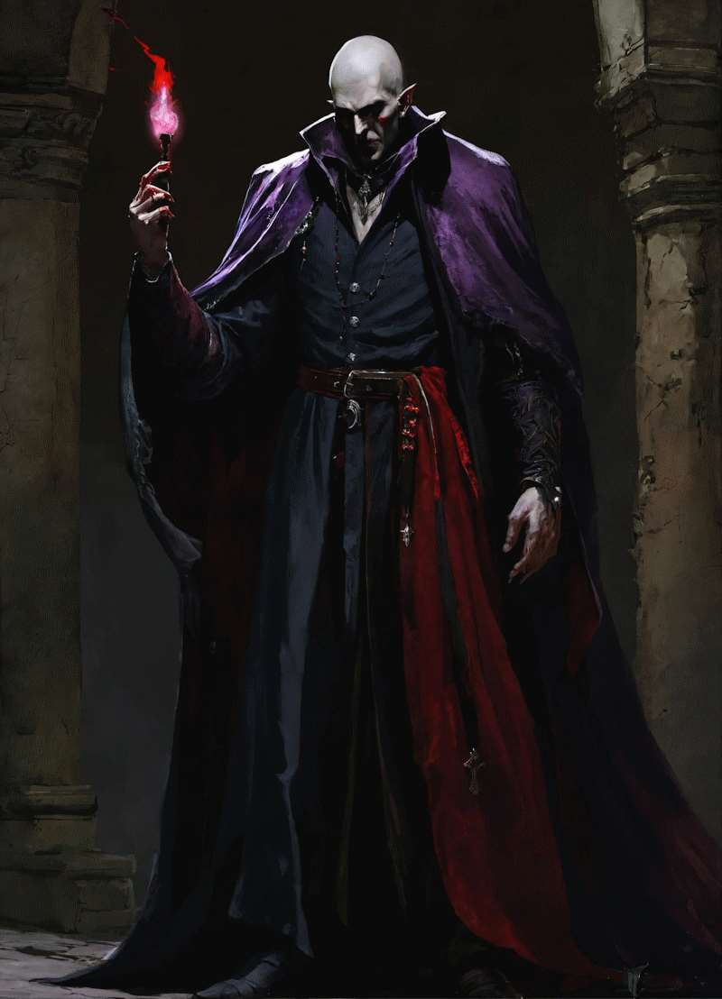
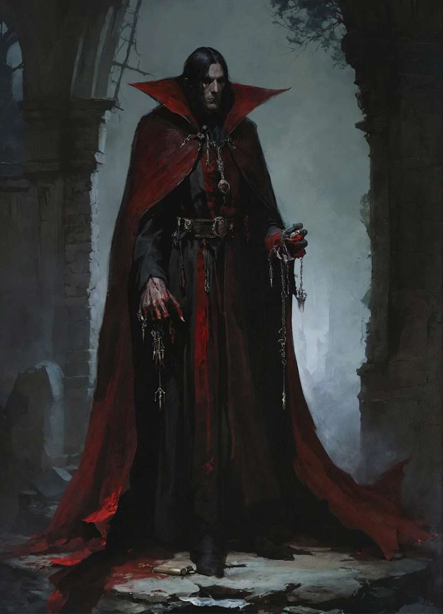

# Tremere Vampires

## Tremere

The Tremere began as House Tremere, mages of the Order of Hermes named for their leader and founder, Tremere. At the end of the first millennium, the members of House Tremere realized the Hermetic arts were failing and found its immortality potions no longer working. Facing the possibility of losing everything, Tremere ordered research into alternate methods of sustaining their lives. House Tremere undertook numerous experiments, but it was Goratrix who devised a solution in his investigation of vampires.

In 1022, Goratrix invited Tremere and six of the founder's closest advisers to participate in the completed ritual, which promised true immortality. Whether Goratrix knew what would happen is known only by him and, perhaps, Tremere, but at the completion of the ritual the participants fell unconscious and were reborn as vampires, their avatars destroyed, and magical abilities partially lost. The mages had gained their immortality but lost the power they lived for.

Though the others would likely have slain Goratrix for his folly (or trickery), Tremere ordered them to halt and declared that they would remain at his side, leaving their chantries in the hands of subordinates while they discovered the powers of their new forms in secret.

Tremere formed a new vampiric clan and studied their new form and powers. They turned their whole covenant into vampires and hid their true nature from the Order.

But soon they clashed with Tzimisce vampires for hunting in their hunting ground. After Tremere finally formulated the thaumaturgy, the blood magic, he and his followers finally fought and won the elder of that house and became a true bloodline. Tremere regained his old power level, even though his magic was much weaker.

House Tremere launched a wizards war against clan Tremere, but that war fizzled out because clan hid among mortal nobility and fighting against them is against the code. War is still on but quiet.

| Field                     | Value             |
| -------------------------- | ------------------ |
| **Born**                  | Unknown            |
| **Died**                  | 1022               |
| **House**                 | House Tremere      |
| **Nationality**           | Transylvania       |
| **Current or last covenant** | —               |
| **Parens**                | Guorna the Fiend   |

---

## Vampire

### Unique Conditions

#### Hungry (sticky)

Mark one of this condition's five boxes to power vampiric stunts. If you are taken out while Hungry, the consequences could be dire: the GM may determine that you embark on a feeding frenzy, killing nearby mortals. The good news, if any, is that the Hungry track clears immediately.

To otherwise clear Hungry, you must feed: establish an advantage on your target (e.g., Grappled), and then realize a successful attack. The subsequent feeding has two possible degrees of intensity:

- Your victim takes a condition representing physical harm. Clear two boxes for a mild physical consequence, 4 for moderate consequence.
- Your victim dies. Clear Hungry.

#### Saliva Addict (sticky)

Impose this condition on anyone you take out in a conflict, provided they have at some point come in contact with your saliva.

A Saliva Addict must ingest Red Court saliva once per session, and failure to do so renders them incapable of lengthy tasks (such as all contests, conflicts, or rolls that the GM specifies require significant time) outside of actions that directly contribute to obtaining the saliva. Recovering from this condition requires three sessions of total withdrawal or supernatural intervention that succeeds against Great (+4) opposition.

#### Tainted Power

Any power the person had before turning into a vampire, remains, but is tainted and requires time to relearn. Tainted power has a cold ambiance, and limited to abilities of night, cold and monsters.

#### Sunburned

After spending a scene primarily in direct sunlight mark a mild consequence "Sunburned". While you are Sunburned, other conditions reflecting physical injury may not be recovered. Recover by spending an entire session out of sunlight. If already Sunburned and a situation occurs wherein you would otherwise mark the condition, write "Sunburned" on moderate or severe consequence. If severe is already marked, you are destroyed by sunlight.

---

### Flaws

#### Monstrous

You look like a scary monster when your flesh mask fails.

#### Susceptibility to Divine Power

Divine aura is doubled as a penalty to your supernatural actions.

---

### Core Stunts

#### Flesh Mask

When not using other vampiric stunts, you appear as an extremely attractive human being and gain +1 on all actions where attractiveness is a bonus. Flesh Mask is unavailable if you are Sunburned or have used your vampiric abilities in the same scene. The GM may also allow certain magic to see past your mask as well.

Flesh mask also masks your Gift for average humans, but not to men of God, mages or animals. Mages feel your gift has dark vibe to it.

#### The Kiss

Your saliva is a powerful narcotic. Whenever you succeed with style on a bite attack (see Hungry), you can declare that your opponent is dosed with your saliva, and you gain +1 to all actions in subsequent exchanges against the same target in the same scene.

#### Vampiric Physique

When brute strength or sheer speed is requisite, call upon your vampiric nature to gain a bonus of +2 per box of Hungry checked. Furthermore, any physical actions taken may (per the GM) include scale (page 182) regardless of whether Hungry is used.

#### Vampiric Toughness

Mark one box of Hungry to soak two points of stress.

---

### Additional Stunts

#### Vampiric Recovery

Outside of conflict, mark one box of Hungry to clear a sticky condition, or two boxes to begin recovery from a lasting condition. These conditions must represent physical injury.

#### Cloak of Shadows

You can see perfectly in the dark and are immune to any potential effect of normal or magical darkness. Additionally, once per session, you may declare that you automatically succeed at hiding from any non-magical attempt to spot you, provided you have a nearby shadow to hide in.

#### Pack Influence

You hold sway over other local Red Court vampires. Once per session, you can declare that you have convinced your local pack to lend you assistance: a minor NPC to help in a scene, a free success at an overcome roll, or an advantage with two invokes. If the Red Court is particularly powerful or organized in your game, you may treat this stunt as the White Court do, using Family Favors as a model.

---

### Tremere Vampire Stunt

#### Blood Magic

You may cast Hermetic Magic that fit the nature of Winter or Night: death, slumber, ice. All blood magic has a cold ambiance, even if its connection to Winter is metaphorical. Blood magic cannot heal except by stealing life force from another to caster himself. Shapeshifting is to night monsters. Casting a blood magic spell costs one mark of hunger, so it is very taxing to Tremere vampire.

Only a person with a Gift turned into a vampire can have this stunt, not average mundane person.

---

### Flaws

#### The Gift

While you don't have the full benefits of the gift, you have nearly all the flaws of it. Flesh mask hides effects of the gift for mundane.

---

# Werewolves

## Werewolf

An ordinary intelligent shapeshifter. Ally, hunter, or border guard.

### High Concept

**Wolf-Blooded Shapeshifter**

### Trouble

**The Beast Hears Every Challenge**

### Core Stunts

#### Wolf Form

Because I can assume the form of a wolf, I gain +2 when I Quickly overcome obstacles involving tracking, pursuit, or wilderness travel.

#### Predator's Senses

Because my senses surpass those of mortals, I gain +2 when I Carefully create an advantage using smell, hearing, or tracking.

#### Pack Hunter

Because I fight as part of a pack, once per scene I may invoke an aspect created by an ally for free.

### Mantles / Aspect Ideas

- Guardian of the Forest Paths
- Owes a Debt to Villa Parfume
- Alpha of the Silver Hills Pack
- Ancient Enemy of the Night Folk

---

## Loup-Garou

Not a "civilized werewolf". A curse. A monster. Feared by all.

### High Concept

**Cursed Loup-Garou, Terror of Provence**

### Trouble

**The Beast Must Hunt**

### Core Stunts

#### Monstrous Strength

Because I am a Loup-Garou, I gain +2 when I Forcefully attack in beast form.

#### Almost Impossible to Kill

Because ordinary weapons cannot truly stop me, once per scene I may ignore a physical consequence of Moderate severity or lower.

#### Nightmare Predator

Because mortal minds recoil from my presence, I gain +2 when I Forcefully create fear, panic, or intimidation.

---

### Unique Conditions

#### The Beast Awakened

Mark this condition when:

- you see blood,
- you are seriously injured,
- the full moon rises,
- someone invokes the old curse.

Effect:

- +2 on Forceful attacks.
- Cannot use Careful actions.
- The GM may compel violent or predatory behavior.

Clears once the beast has calmed down.

---

### Campaign Notes

**Werewolves**

- can negotiate
- can make agreements
- can be allies of the Covenant
- can guard a faerie regio

**Loup-Garous**

- do not belong to packs
- are rare
- vampires fear them
- mages fear them
- their appearance is always an adventure
