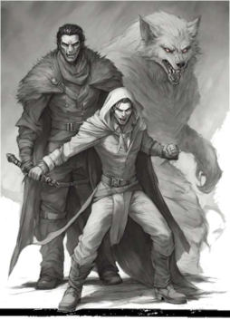

# Fate of Ars Magica

## Why Fate?

Ars Magica is perfect for what it is meant for – a simulation for the life and progression of a group of mages living in mythic Europe.

What it is not great for: a quick game for busy people living their lives, going to work, taking care of children.

A rules-light version is easier for the game master so they can focus on the story and the fun, not realism.

## What Do You Need?

1. Copy of Ars Magica
    [Ars Magica Core Rules](https://atlasgames.com/product_tables/AG0204)
2. Book of Fate Core, or SRD
    [Fate SRD](https://fate-srd.com/)

## Character Creation  

### Step 1: Choose Aspects

- **High Concept** – The idea of your magus
- **House** – What house do you belong to?
- **Nationality** – Defines your culture and native language. (All mages know Latin)
- **Personality**

**Extra details**

- **Gift**, normal or different

- **Bodyguard**: who is your companion.
- **Nature**: Leader, Negotiator, Explorer or Builder.

### Step 2: Details

- Name and description

### Step 3: Skill Tree

Character gets:

- **One Great Skill**
- **Two Good Skills**
- **Three Fair Skills**
- **Four Average Skills**
- **The rest are Mediocre**

### Skill List

- Alertness
- Burglary (lock picking, pocket picking, traps)
- Contacts
- Fight (light , martial, heavy weapons, ranged, firearms)
- Influence (Persuasion, Deception, Leadership, Negotiation, Intimidation)
- Investigate (Deduction, Scrutiny, Research, Observation, Interrogation)
- Lore (1 lore per skill level: Church, Hermetic, Faerie, Infernal, Twilight)
- Languages (1 per language)
- Magic Theory (Parma Magica, Latin)
- Medicine (first aid, surgery, herbal medicine, infectious)
- Physique (brawling, Weight lifting, athletics)
- Resources (useless to mages)
- travel (ride, sailing, Orienteering)
- Stealth (sneak, hide)
- Survival (area)
- Will

Nearly any skill might have sub-skills.

For every skill level character gets a new sub-skill, of equal skill level.

### Step 4: Magical Arts (or Stunts)

A companion can choose up to 3 stunts, but a magus must take the following:

- **Hermetic Magic**  
- **Parma Magica**  
- **House Stunt**

### House Stunts

Each house has a default stunt, but with a good explanation, a character may take a different stunt.

| **House**          | **Stunt**                                                    |
| ------------------ | ------------------------------------------------------------ |
| **Bonisagus**      | +2 when inventing spells                                     |
| **Björnaer**       | Heart Beast                                                  |
| **Ex Miscellanea** | magical virtue.                                              |
| **Flambeau**       | Choose Technique + Form combo. That combo gets +2 in combat. |
| **Guernicus**      | Hermetic Law +2                                              |
| **Jerbiton**       | Noble status, mostly baron                                   |
| **Mercere**        | Hermetic influence +2                                        |
| **Merinita**       | Faerie magic                                                 |
| **Tremere**        | Certamen +2                                                  |
| **Tytalus**        | Combat stunt                                                 |
| **Verditius**      | Verditius magic +2 crafting magical items                    |

Magus starts with a **refresh of 3**. They can learn new stunts after their first milestone.

### Magical Arts & Study Points

  A magus has **15 study points** to spend on magical arts. Max 5 into one art at the beginning.

| **Art Rating** | **Study XP Cost** |
| -------------- | ----------------- |
| 1              | 1p                |
| 2              | 3p                |
| 3              | 6p                |
| 4              | 10p               |
| 5              | 15p               |

### Magical focus

A character can choose different play styles for their magical arts:

- **Specialist** – One art at **5**  
- **Dual Art**, arts at **3,3,2**
- **Focused** – Arts at **4, 2, 1, 1**  
- **Tech Generalist** – Arts at **2, 2, 2, 2, 2**  
- **Academic** – All arts at **1**  

Bonisagus might focus on Vim, or Intellego, Flambeau usually focuses on creo, ignem and rego there too, Tremere might be focused on rego, with several combat oriented forms.

### Magic Skill Usage

Magic skill tests use **Technique + Form**.  
For example, **Tech 4 + Form 2** = **Fantastic (+6)**.

In Combat, roll Tech + Form + 4DF against opposing rating. Yes, maguses are supernaturally powerful.

### Spells

A magus gets **30 levels of spells** (equivalent to **150 Ars Magica spell levels**).

So divide Ars magica level by 5 to get Fate of Ars magica level. Level below five are

- 4=0, 3=-1, 2=-2, 1=-3

### Step 5: Virtues and Flaws

- A character can choose **3 points** worth of virtues and flaws:  
  - **One major** virtue or flaw (worth 3 points), OR  
  - **Three minor** virtues or flaws (worth 1 point each), OR  
  - **Two virtues and two flaws** of equal value.  
- Or take One major virtue Flaw pair, and one minor virtue flaw pair.
- **Flaws** can give fate points.  
- **Virtues** might **cost** fate points.  
- For bonuses, use **+2 or +1**, as appropriate.

### Companion

- Create a character with the same skill tree.  
- Choose **3 flaws** and either **3 virtues or 3 stunts**.

### Grogs

- Grogs use **6 approaches** with the following ratings:  
  - **+2, +1, 0, 0, -1, -2**  
- They have a **high concept** and **trouble aspects**.  
- Start with **1 fate point**.  
- Use **Fudge Accelerated** mechanics.

---

## System Conversion

- **5 Ars Magica spell levels** = **1 spell level** in **Fate of Ars Magica (FOAM)**.  
- Example: *Ball of Abysmal Flame* (level 35) = **level 7** in FOAM.  

### Spell Levels Under 5

- Characters are **not meant** to study **formulaic spells under level 1**.  
- These spells can be cast as **spontaneous spells** at **Difficulty 1**.

---

## Casting Spells

**Your skill = Technique + Form + 4DF**  
- If the spell is resisted, this is the **success rating**.

### Formulaic Spells

- If your result is **equal to spell level**, you **succeed**.  
- If your result is **1 or 2 lower**, you **succeed**, but **lose a fatigue level**.  
- If your result is **3 lower**, the **spell fails**, and you **lose a fatigue level**.

### Spontaneous Magic

A caster can choose **one of two casting methods**:  

1. **Defined Spell Effect**  
   - If the final roll is **lower than the spell level**, the spell **fails**.  

2. **Variable Spell Effect**  
   - If the **minimum spell effect succeeds**, excess success points can be **spent on variables** to adjust the outcome.

---

### Fatiguing Spontaneous Magic

Formula:  
`(Tech + Form) / 2 + 4DF`

---

### Non-Fatiguing Spontaneous Magic

Formula:  
`(Tech + Form) / 2 + 4DF`

To **cast in one round**, the caster must:  
- Spend a round to **create an advantage**, OR  
- Spend a **fate point** to cast immediately.

---

## Circumstantial Penalties

| **Casting Method**                 | **Modifier** |
| ---------------------------------- | ------------ |
| Speaking loudly & grand gestures   | **+1**       |
| Speaking quietly & subtle gestures | **-1**       |
| Silent casting & no gestures       | **-2**       |
| Speaking loudly & subtle gestures  | **0**        |
| Silent casting & grand gestures    | **0**        |

## Certamen

### Hermetic Duel Rules

1. **Challenger** chooses **Technique**.  
2. **Defender** chooses **Form**.  
3. **Attack** uses **Technique OR Form**.  
4. **Defense** uses **Technique OR Form**.  
   - If **Technique** is used for attack, **Form** is used for defense.  
   - Only the declared **Technique** and **Form** may be used in the duel.  
5. **Damage is fatigue**.  
6. **Parma Magica** provides **fatigue stress points**, which are depleted before actual fatigue.  
7. **Tremere Mages** have a **Minor Magical Focus: Certamen**, meaning they **get +2 ** in a duel.  

---

## Stress and Consequences

- **Physique** determines **physical stress** and **consequences**.  
- **Will** determines **mental stress** and **consequences**.  

### Stress Points

| Level              | Stress Points                 |
| ------------------ | ----------------------------- |
| **Terrible**       | 0                             |
| **Mediocre, Poor** | 00                            |
| **Average, Fair**  | 000                           |
| **Good, Great**    | 0000                          |
| **Superb+**        | 0000 + Extra mild consequence |

- **One stress point absorbs one damage point.**  

### Fatigue

- **Fatigue** is a new consequence type, working like mental consequences but accumulating **faster**.

#### Fatigue Penalty & Recovery

| Fatigue Level     | Penalty | Recovery Time  |
| ----------------- | ------- | -------------- |
| **Mild**          | -0      | **6 minutes**  |
| **Moderate**      | -1      | **10 minutes** |
| **Severe**        | -2      | **20 minutes** |
| **Incapacitated** | Out     | **60 minutes** |

- **Recovery time** shows how long it takes for **fatigue to drop one level** (e.g., from **incapacitated to severe**).  
- **Penalties apply after spellcasting**, meaning a **heroic caster can push themselves into incapacity** while still successfully casting a spell.

---

## Weapons & Armor

| Weapon Rating | Weapon Type        | Armor Rating | Armor Type           |
| ------------- | ------------------ | ------------ | -------------------- |
| **1**         | Small weapon       | **1**        | Light armor          |
| **2**         | One-handed weapon  | **2**        | Medium armor         |
| **3**         | Two-handed weapon  | **3**        | Heavy armor          |
| **4**         | Extra heavy weapon | **4**        | Magical battle armor |

- **Weapon rating adds to damage**.  
- **Armor rating reduces damage**.  
- **Parma Magica acts as magical armor**.  
- **Armor rating reduces Parma Magica rating**.  

**Red is for weapons**: The more Red your weapon has, the bigger and/or deadlier it is. A Red: 1 weapon could be a dagger, a goblin’s claws, or a very low-caliber pistol, while a Red: 4 weapon could be a great-sword, a dragon’s bite, or a close-range blast from a fireball.

When you attack, for every point of Red your weapon has, replace one of your usual Fate dice with a Red Fate die. If your attack outcome is a tie or better, each of your Red dice that comes up + increases the hit by +1 shift of harm.

**Blue is for armor**: The more Blue armor your armor has, the more protective it is. Light armor, like cured leather or tough hide, is Blue: 1. Heavy armor, like a mail hauberk or plate armor, is Blue: 2 or 3.

When you defend, for every point of Blue your armor has, replace one of your usual Fate dice with a Blue Fate die. If your defend outcome is a failure or a tie, each of your Blue dice that comes up a + absorbs 1 shift of harm.

You can also use Blue dice instead of red dice if you fight defensively with spear or quarterstaff.
With rapier, floret sword, you have that option against light, medium sized weapons.

---

## Parma Magica

- **Always adds to defense** (**both passive & active**).  

### Blocking

- **With a spell:**  
  - `Casting Total + Parma Magica`
- **With Willpower:**  
  - `Form + Parma Magica + Dice`
- **Passive Defense:**  
  - `Parma Magica`

- A mage performing a **Parma Magica ritual** spends a few minutes to gain **magical protection equal to their Magic Theory rating**.

## Resources

- **Magi and companions** can use **Covenant’s resources** instead of their own.  
- Many magi **do not have a personal resource ability**.  

### Purchasing Rules

1. **If the cost of a service or item is several levels below resource ability:**  
   - **No roll required**, the purchase **succeeds automatically**.  
2. **If the purchase is more expensive, roll for success:**  
   - **1 success grants one of the following:**  
     - **Fast** – Obtain it quickly (quality uncertain).  
     - **Cheap** – Obtain it at a reduced cost.  
     - **Good** – Obtain a higher-quality version.  
3. **If the cost is equal to resource level:**  
   - Choose **Cheap**, OR  
   - **Resource level drops by one** for a **season**.  

---

## Experience

- **Skills and Stunts** use **Fate Core** rules.  
- **Minor Stunt:** Bonus is **+1**, not +2.  
- **Minor Stunt** and **Minor Virtue** are **equal in value**.  

---

## Magic & Study

- **Mages are academics**, always studying and researching magic.  
- **Mages can only spend a few days per season on missions** if the need is great enough.  
- **Between each session or mission, a full season of study occurs.**  

### Study Progress per Season

A character can choose **one** of the following:  

1. **Gain 1 XP for Arts**  
   - **New level costs XP equal to the new level**.  
   - **Art level is capped by Magic Theory.**  
2. **Learn a new spell.**  
3. **Invent a new spell.**  

Learning arts above Magic theory is only possible with a teacher, use teacher's magic theory rating.

Learning arts and spells should go hand in hand, you cannot keep on studying arts without practical study, sooner or later you have to study the spells of the art you study.

#### Studying with a Teacher

- **Art limit** is the **teacher’s Magic Theory level**.  

#### Studying a Spell from a Book or Library

- Character gains **spell levels** equal to:  
  - `Technique + Form + Covenant (magic) Aura`  

#### Inventing a Spell (If No Suitable Spell Available)

- Character gains **new spell levels** equal to:  
  - `(Technique + Form + Covenant Aura) / 2`  

---

## Adventuring Magi

- A **party** consists of **one magus** and **several companions**.  
- **Each session/mission**, one player **plays their magus**, while others play their **favorite companion**.  
- **Maguses can only afford one or two days of adventuring per season**.  
- **Adventuring is required to gain new skills.**  

# Longevity Potion

- **Creating a longevity potion** takes **one full season**.  
- Drinking the potion **renders the magus sterile** but **drastically slows aging** (aging shifts to **month/year** instead of year/year).  

###  Potion Creation

1. **Calculate skill total:**  
   - **Magic Theory + Magic Aura + Wealth Modifier**  
   - **Wealth Modifiers:**  
     - **Wealthy**: +1  
     - **Poor**: -1  
2. **Declare potion difficulty:**  
   - Typically **a bit higher than the magus' skill**.  
3. **Roll Skill Total + 4DF:**  
   - **Success** → Potion extends lifespan.  
   - **Failure (even by 1 level)** → Potion may grant minor longevity benefits to mundanes but might also cause **Warping**.  
   - **Success with Style** → Potion **gains +1 potency level**.  

### Potion Potency Table

| Potion Total   | Max Age Before Potion Wanes | Warping Level |
| -------------- | --------------------------- | ------------- |
| Fair (+2)      | 30                          | 0             |
| Good (+3)      | 50                          | 0             |
| Great (+4)     | 75                          | 0             |
| Superb (+5)    | 105                         | 1             |
| Fantastic (+6) | 140                         | 2             |
| Legendary (+7) | 180                         | 3             |
| Epic (+8)      | 225                         | 4             |
| Fabled (+9)    | 275                         | 5             |
| Avatar (+10)   | 330                         | 6             |

### Potion Potency Loss & Aging

- A **magus feels the potion weakening** **one year** before it fails.  
- He has **four seasons** to:  
  - **Brew a new potion**, OR  
  - **Buy a potion from a better magus or a stronger aura**.  
- Once the potion fails:  
  - The **magus ages rapidly**, reaching his **real age in 1 year**.  

---

## Warping & Twilight  

- **Once a magus surpasses the natural human lifespan**, **longevity magic starts warping him**.  
- In **high magic zones** or during **intense magic use**, the magus **may fall into Twilight**.  
- **Twilight Effects:**  
  - **The magus' body becomes indestructible** and unresponsive.  
  - **His soul travels to the Magic Realm** for an unpredictable time.  
- **After returning, roll 1d10:**  

### Twilight Effects Table  

| Roll   | Effect                           |
| ------ | -------------------------------- |
| **1**  | Strong Faerie Blood              |
| **2**  | Side Effects                     |
| **3**  | Incomprehensible                 |
| **4**  | Blatant Gift                     |
| **5**  | Magic Addiction                  |
| **6**  | Susceptibility (to one effect)   |
| **7**  | Warped Magic                     |
| **8**  | Plagued by a Supernatural Entity |
| **9**  | Supernatural Nuisance            |
| **10** | Chaotic Magic                    |

- **If an effect is rolled twice**, either take a **variant** of it or **reroll**.  

## Scale

When two entities enter into a conflict with one another, the differences in their scale come into play. For every step that separates them, apply one or both of the following effects to the larger of the two:

- +1 to the attack roll *or* +1 to the defense roll
- Deal +2 shifts of harm on a successful attack *or* reduce incoming harm by 2

**Scale**

- **The Searing Age** (age up to 100) – Represents the fiery beginnings of magical power or immortality, where one's power is sharp and still growing. Young mage, young vampire.

- **The Dusk born Age** (age up to 300) – Suggests a time when one has moved beyond youth but still retains a certain liveliness and ambition, reminiscent of dusk before the full night. Arch magus, experienced vampire.

- **The Veiled Age** (age up to 600) – A time of great wisdom and mystery, where the individual becomes more enigmatic and their knowledge veiled in secrecy. At this scale the power play changes into very very careful, no risk game.

* **The Twilight Age** (age up to 1000) – A period where the being has seen much, and their existence becomes more shadowed, reflective of twilight when day and night blur. Behind the scenes vampires, oldest known vampires in existence.

* **The Eternal Twilight** (age up to 3000) – This scale suggests a nearly incomprehensible age, where the being has transcended most notions of time, embodying an endless, ageless twilight. Legendary Methuselah vampires, Cain, Isis

# **The Covenant**

 The **Covenant** is the **main character** of any campaign.

## **Starting Covenant Traits**
 A newly established Covenant begins with:

- **Magic Aura:** +1
- **Mundane Resources**
- **Companions:** 1 per magus
- **Grogs:** 1 per magus
- **Coven Folk:** 2 per magus  
  - Includes **blacksmiths, carpenters, bookbinders, servants, etc.**
  - **No specialized skills** at the start.

---

## **Building a Beginning Covenant**
 A Covenant must prioritize four key areas:  

1. **Art Summae**  
2. **Spell Library**  
3. **Vis Resource**  
4. **Specialists**  

Assign priority levels:  
- **1st choice:** **Great** (+4)  
- **2nd choice:** **Good** (+3)  
- **3rd choice:** **Fair** (+2)  
- **4th choice:** **Average** (+1)  

## **Key Covenant Features**

### **Art Summae**
- A magus may **study an Art** as long as it is **below** the Summae rating.

### **Spell Library**
- To **find a specific spell**, roll:  
  **Spell Library + 4DF**  
  - If **rating + roll ≥ spell level**, and spell level is within the library’s rating, the magus **finds the spell** and can learn it.
- If **another magus** tries to learn from the same book **simultaneously**, **increase difficulty by +1**.

### **Vis Resource**
- **Vis** is a **magical currency** needed for:
  - **Rituals**
  - **Aegis of the Hearth**
  - **Crafting magical items**
- To **use Vis** without depleting the resource, roll **Vis Resource** and succeed.  From Fair resource you get 2 vis points.
  - **Failure** reduces the Vis Resource for **one season**.

### **Specialists**
- Specialists provide unique advantages.  
- Most specialists have a **stunt** giving **+2 to their skill**.  
- A **Good (+3) specialist** is considered **highly skilled**.

---

## **Hooks & Boons**

A Covenant may take **1 Boon per Hook**.  
- **Major Hooks** allow **1 Major Boon**.  
- **Minor Hooks** allow **1 Minor Boon**.

### **Major Boon Example**
- **Magic Aura +1**  
- **(Warning)**: A **Magic Aura of +3 or more** causes **Warping** in mundanes.

### **Common Hooks**
| Hook                | Hook Type |
| ------------------- | --------- |
| Unknown Hook        | Minor     |
| Beholden (Favors)   | Minor     |
| Contested Resources | Minor     |
| Monster             | Major     |
| Politics            | Minor     |
| Poverty             | Minor     |
| Protector           | Minor     |
| Regio (Hostile)     | Major     |
| Rival               | Minor     |
| Road                | Minor     |
| Superiors           | Major     |
| Urban               | Minor     |

### **Available Boons**
| Boon                                 | Boon Type |
| ------------------------------------ | --------- |
| **Aura** (+1)                        | Major     |
| **Buildings**                        | Minor     |
| **Fortifications**                   | Minor     |
| **Hidden Resources** (**Superb** +5) | Major     |
| **Prestige**                         | Minor     |
| **Regio (Magical)**                  | Major     |
| **Seclusion**                        | Minor     |
| **Wealth (Mundane)**                 | Minor     |

# **Villa Perfume**

## **Overview**
- **Location:** A small hill near a road, leading to Nice.  
- **Leader:** **Giovanni Grimaldi** (formerly led by Arch Magus Mikkel Madssen).  
- **Wealth:** Villa Perfume thrives due to its **specialist perfume maker**.  (Jean-Baptiste Grenouille)
- **Perfumes:** Created from flowers harvested in a **Faerie Regio**, making them rare and exotic.  More cheaper perfumes made from common flowers.
- A spontaneous spell Oleum Flos by Giovanni turns flowers into essential oils instantly (MuHe lvl 3), speeding up processing very much.

### **History**
- The land was once home to a **child-eating Tzimisce vampire**, who was **defeated by Arch Magus Mikkel Madssen**.  
- Mikkel intended to **take with him all his apprentices and allies,** here, but only his latest apprentice, Giovanni, followed.  
- **Mikkel was eaten whole** by a **Faerie Dragon** while exploring. **He’s definitely dead… right?**  
- Mikkel bought the land into name of his apprentice Giovanni to make it a legit barony. Once he disappeared, Giovanni became a valid baron of the land, delegating as much work as possible. He still signs judgments from serious crimes just to see fairness happening.

### **Structure & Magic Regio**
- The **Covenant is entered** via **one door in the mundane manor**.  Mundane manor is where perfume is sold. Around it there are many houses processing flowers and perfume. Most of it run by a dangerous psychopath Grenouille who has a personal guard that is not protecting him, but protecting people from him. Average specialist with a hook psychopathic, gives him a magical virtue of supernatural sense of smell.
- **Climbing the stairs** leads into the **Magical Regio**, where a **greater, more magnificent version of the manor** exists.  

---

## **Covenant Priorities**
- **Art Summae:** **Great** (+4)  
- **Spell Library:** **Good** (+3)  
- **Vis Resource:** **Fair** (+2)  3 vis / season. Stock = one year, 12.
- **Specialist:** **Average** (+1)

# Vis resource
| Vis ratin | Vis per season |
|------------|----------------|
| Average (+1) | 1              |
| Fair (+2)    | 3              |
| Good (+3)    | 6              |
| Great (+4)   | 10             |
| Superb (+5)  | 15             |

## **Hooks & Boons**

 **Major Hooks**

- **Faerie Regio** (*The forest houses a Faerie Regio where rare flowers grow, but a Faerie Queen lives within. Dealing with her could have dire consequences.*)  

### **Minor Hooks**
- **Protector** (*The Covenant must protect nearby villages from vampires and faeries.*)  
- **Road** (*Merchants travel to buy perfumes, increasing trade but also attention from rivals.*)  
- **Contested Resource** (*Selling goods in Nice causes power struggles with the ruling Count and his Ventrue vampire wife.*)  

### **Major Boons**
- **Magical Regio** (*A grander, magical manor exists within the Regio.*)  
- **Magical Aura 2** (*The Covenant benefits from a potent magical environment.*)  

### **Minor Boon**
- **Wealth** (*The Covenant is very wealthy due to perfume sales.*)  
- Mages and personnel live in luxury, like House Lannister.

---

## **Personnel**

- **Perfume Maker’s Help**  

- **Blacksmith**  
- **Carpenter**  
- **Glass Smith**  
- **Bookbinder**  
- **Cleaner**  
- **Cook**
- **Trader**

### Hooks 

  There is a Faerie Regio in the forest that provides the flowers to the perfumes, but it is inhabited, and the players must be careful not to awaken the dragon. The Nice is ruled by a Count married to a Ventrue vampire, so selling goods in Nice creates a power struggle with vampires. And magi must give some protection to the people close by from vampires and from faeries. 

Barony has a troublesome Toreador vampire and loup garous.

# Aura

There are 3-4 aura types.

### Magical Aura

- Helps magic use, lab activity, study of magic.
- Aura of 3 starts warping people, increasing twilight.

### Faerie Aura

- Add spell casting, not to lab activity
- For each point of Faerie aura, add a wild magic dice.
  - If Wild dices come up with pluses, increase spell effect
  - If Wild dices come with minuses, spell starts to have independence
  - -1 mild will, -2 independent will, -3 hostile and independent

### Dominion Aura

- Minus to magic casting, bonus to Messianic Voices magic.

- Backlash directs spell to attacks the mage

## Renaissance

From 1600 onward, cities and universities start to have a new aura

### Rational aura 

- Minus to magical casting
- Casting obviously supernatural spell causes a mage to have paradox stress damage
  - Character gets stress equal to spell level cast.
  - Player must spread damage among paradox consequence and stress slots (1,2,3,4) Notice more complicated system.
  - Stress slots heal faster, and consequences pretty slowly
  - Paradox produces a magical anomaly consequences light glowing, strong static energy, souring milk,  make babies sick etc. Typical witch stuff.

#### Aura level

0. stress heals 1/ minute, consequence heals mild/day, moderate/week, severe/month
1. stress heals 1/hour, consequences heal week/month/season
2. Stress heals 1/day, consequences heal month/season/year
3. Stress heals 1/week, consequences heal mild/season, higher do not.

#### In Magical aura

1. Stress heals 1/turn, consequences heal Mild/hour, Moderate/day, Severe/week
2. Stress heals in a turn, consequences heal mild/minute, Moderate/hour, severe/day
3. Stress heals instantly, consequences heal turn/minute/hour

### Receiving paradox stress

  Nixette casts a fireball in a city, spell level 7.

- aura 1 reduces her skill by 1.
- Casting vulgar, obviously supernatural effect in a city with witness gives her 7 paradox stress.
- Nixette can absorb 3 points to her 3 stress slot, remaining are 1,2,4.
- The rest of 4 must be absorbed into moderate consequence, Making her float in water. This sticks with her for a week if she stays in a city, but in her Magic aura 2 covenant it heals in an hour.
- Nixette keeps on casting, she casts "Panic of the trembling heart" into a guard. This is perfectly coincidental, so no paradox.
- She then casts Wall of Protecting stone to block guards so she can escape. That is level 5 spell, perfectly vulgar. She absorbs 4 paradox on her stress track (3,4 taken) and suffers a mild consequence, making her sour milk in her presence. Mild consequence absorbs 2 points, so 1 is wasted.
- Nixette leaves the city. Outside the city Rational aura is 0, so is magical aura. She heals her supernatural stress in 7 minutes. then she reaches her covenant, and it takes her a minute, she loses her mild magical consequence, and after one hour she can swim again.
- Casting vulgar magic without any witness halves paradox stress.
- Masking vulgar magic according to local believes might make it coincidental, no paradox stress damage.

