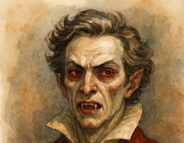

# Sample quests

## 1. Rapunzel

Giovanni Grimaldi gets a perfume deal if he saves his cousin Doucelle. Marco Polo immediately volunteers to save her, as his powers are very fit for a hit and resque mission.

Sadly they cannot find her, until Anders suggests that what if she is in fairy region. So a search party is formed to travel to capricious fairyland where a tall tower is found.

**Twist:**

Doucelle, a girl with fairy blood, is pregnant to a fairy prince. Should she stay, she could marry a fairy prince and have a royal family. But this botches a perfume deal and angers Giovanni's family.

### THE LEANSIDHE’S HELL-HOUNDS

### High concept: 

Pack of Large Fae Hounds

### Other Aspects: 

Used to Be People

### APPROACHES

- **Good at (+2)**: Tracking Prey, Biting, Running  
- **Bad at (-2)**: Staying Focused, Acting Independently  
- **Good at Opposing (+2)**: Focus, Intellect

### STRESS & CONDITIONS

- **Stress**:[][][][][] [] [] [] [] []

- **Dwindling Numbers (sticky)**:  [2] [2] [2] [2] [2] [2] 
  The hell-hounds are not solitary creatures; they prefer to remain in packs. As long as this condition has unchecked boxes, this “creature” represents a group of hell-hounds acting in concert. As a group, the pack has scale when dealing with lone targets. The hellhound may check a box to absorb up to 2 shifts in damage, representing individual hounds being taken out or driven away. This condition is recovered between sessions as hounds return to the Leanansidhe or she bolsters the numbers of those lost.

- **Obedience (sticky)**:  [] [] [] [] [] 
  If able to communicate with her hell-hounds, the Leanansidhe may give them orders. They then check boxes of Obedience according to their stunts to aid themselves in obeying these orders. Recover this condition when the hounds are able to spend time resting in the company of the Leanansidhe.

### STUNTS

- **Group Tactics**:  
  Hell-hounds are most effective in large packs. For every unchecked box of Dwindling Numbers, add +1 to any Tracking Prey roll.

- **A Need to Please**:  
  If taking an action that directly aids obedience of the Leanansidhe’s orders, the hell-hounds may check a box of Obedience in lieu of spending a fate point to invoke aspects.

## Crone

###  High Concept:  

 Winter Mage of the Winter Court, True Fairy

### Other Aspects:  

- Wields Ice and Darkness with Unrivaled Grace  
- Enigmatic and Cold, Bound by the Court’s Laws  
- A Dangerous Ally, But a Deadly Foe  
- Embracing the Icy Silence of Winter's Heart

### APPROACHES

- **Good at (+2)**:  
  - Ice Magic  
  - Deception  
  - Manipulating the Cold  
  - Winter Court Politics  
  - Endurance in Harsh Environments

- **Bad at (-2)**:  
  - Warmth, Empathy  
  - Emotional Connection  
  - Flexibility (in behavior and environment)

- **Good at Opposing (+2)**:  
  - Resistance to Heat or Fire  
  - Mental Focus and Willpower  
  - Subterfuge and Hidden Knowledge

#### STRESS & CONDITIONS

- **Stress**:  [][][][][] [] [] [] [] []  

- **Winter’s Embrace (sticky)**:   [2] [2] [2] [2] [2] [2] 
  Crone’s power grows with the harsh winter. As long as this condition has unchecked boxes, Crone is empowered by Winter’s full strength. She may invoke this condition to deal additional damage with ice and frost-based powers or increase her resistance to magical attacks. This condition is recovered when Crone rests in the heart of Winter’s realm, the icy depths of her domain, or when her powers are replenished by the Winter Court.

- **Bound by the Court’s Laws (sticky)**:  [] [] [] []    
  As a True Fairy of the Winter Court, Crone is bound by the Court’s ancient laws. If she defies or breaks these laws, she risks the Court’s wrath. When obeying the laws of the Court, she may gain a bonus to any action involving diplomacy or exerting authority within the Winter Court. This condition is reset when Crone is within the realm of Winter and remains loyal to its rules.

#### STUNTS

- **Frost-weaver**:  
  Crone may shape and manipulate ice and frost with ease. For every unchecked box of Winter’s Embrace, add +1 to any magical roll involving ice, cold, or frost magic.

- **Frozen Heart**:  
  Crone can resist attempts to manipulate her emotions or thoughts. For every box of Bound by the Court’s Laws that remains unchecked, add +1 to any resistance roll against emotional or mental influence. 

- **Winter’s Command**:  
  Crone can call upon the power of Winter to freeze her enemies in place. Once per session, Crone may invoke Winter’s Embrace to immobilize a target for a turn or gain a +2 bonus to a roll to hinder their actions with cold or frost-based magic.

- **Court’s Favor**:  
  When Crone follows the Winter Court's rules, she gains favor among its members. When invoking a Winter Court ally or resource, Crone may reduce the difficulty of any roll related to the Court’s politics or interaction by +2.

## 2. Little Red Riding hood

There is a nice old lady living in the middle of a dangerous forest, in a small cottage.

How can she survive the horrible werewolf that rampages the area?

#### Twist:

- Actually, she is the werewolf. Should the troupe find a way to cure her?
- that would be a high Perdo Vim ritual...
- Or a quest to right a wrong 
- Or simply silver stab her black heart.

### LOUP-GAROU

#### ASPECTS

- **High Concept:** Rampaging Wolf-like Demon  
- **Other Aspects:** Fearsome Teeth and Mighty Claws  

#### APPROACHES

- **Good (+3):** Force  
- **Average (+1):** Focus, Guile  
- Special: **Rage (+4)**, blind rage attacks

#### STRESS & CONDITIONS

- **Stress:** [] [] [] [] [] []  
- **Physical Immunity (special):** [x] This condition starts checked. The loup-garou does not take damage and cannot be taken out for any reason save with penetrating attacks forged in inherited silver, which deal damage as normal.  
- **Blood-lust (special):** [x] This condition is always checked. The loup-garou is driven to kill, cannot resist those instincts, and actively hunts human targets for slaughter. If mortals are near, it may prioritize which one to pursue but it must go on the attack.  
- **Frenzied (sticky):** [ ] Mark this condition if the loup-garou is attacked; this condition absorbs any damage from the attack if it bypasses the creature’s Physical Immunity. The demon is then enraged, more powerful but less controllable, and gains a new approach, Rage, at Great (+4). It cannot, however, sensibly prioritize targets, attacks the nearest target of which it is aware, and does nothing beyond attack or pursue until that target is dead or the loup-garou is unable to continue its pursuit, at which point it moves on to its next victim. Recover this condition when no one remains for the loup-garou to target.  

### STUNTS

- **Out of Nowhere:** Once per session, the loup-garou may burst through a window or wall into any scene that occurs during a full moon. Frenzied is automatically checked.

3. The Innocent man

Judge of Cagne Sur Mer has found a man guilty of murder. By a coincidence Anders Wirtzenius is there and read his mind, revealing that he actually was a witness to a murder, but all the evidence points at him.

Anders just has to prove his innocence. He announces he will be his defense lawyer.

- He cannot reveal he is a mage, and magic is not evidence in court
- The real murderer is a vampire noble, something you cannot just say as officially vampires do not exist.
- Anders must find mundane evidence of the real killer

### Three trials

- Blood that don't spill
- Secret of the locked room
- The trial

### 3. Baron Vittorio della Rosé

According to peace treaty, vampires are not allowed to live in area owned/managed by Hermetic mages, and hermetic mages are not allowed to live in an area owned/managed by vampires.

Marco polo and companions go to baron to announce his expulsion from barony, as a hermetic mage now manages it.

He does not take it lightly and kills Jean Luc Picard, a grog who hands him the letter of expulsion.

Magi and companions cannot kill the baron or face a war between order of Hermes and Camarilla. But they can slay his ghouls and minions that attack them.

Should baron wait for a month, he becomes an outlaw and is freely killable, also, if he attacks the covenant.

### Baron Vittoria Della Rosé
 

####  ASPECTS  
**High Concept:** Centuries-Old Red Court Vampire Noble  
**Other Aspects:** Cruel and Vain Toreador; Bitter Over Lost Territory; A Taste for Noble Blood  

#### APPROACHES  
**Superb (+5):** Deception  
**Great (+4):** Fight, Guile  
**Good (+3):** Focus, Intimidation  
**Fair (+2):** Athletics, Presence  
**Average (+1):** Empathy  

#### STRESS & CONDITIONS  
**Stress:** [] [] [] [] [] []  
**Hungry (sticky):** [] [] [] [] []  

  - The Baron must feed on human blood to maintain his beauty and strength. If unchecked, he starts losing his youthful appearance and becomes monstrous.  
**Exposed (sticky):** [][][][]  
  - If his human-like form is compromised, he must retreat or use illusions to mask his true nature.  
**The Blood Curse (special):** [ ]  
  - Vittoria can infect others, turning them into Red Court vampires. If he chooses to create a new servant, he checks this box.  

### STUNTS  
**Predatory Grace:** Gain +2 to Deception when charming or seducing a target before feeding.  
**Inhuman Speed:** Once per scene, act twice in succession by spending a Fate Point.  
**Monstrous Strength:** Ignore two shifts of physical damage unless caused by silver, fire, or holy weapons. 
**Vampyric Regeneration:** Spend a Fate Point to remove two stress boxes of physical damage instantly.  
**Master of the Masquerade:** Gain +2 to Guile when maintaining a noble human persona.  

### BACKGROUND  
Once a celebrated Venetian noble and Toreador artist, Baron Vittoria Della Rosé lost his title and lands to a rival centuries ago. Now, he haunts the shadows of Cagne sur Mer, tormenting its people out of spite. A master manipulator and deadly predator, he revels in fine arts, exquisite wines, and the slow destruction of his enemies. Though his beauty is legendary, behind his human mask lurks a monstrous Red Court fiend, eager to feast on those who cross him.  
